# NBA Success Predictor

## **Overview** 

In this project, we will build a supervised machine learning to analyze a dataset of NBA players from 2003 to 2020 in order to predict whether players will be successful in the NBA. We intend to construct this model with two levels, our first level will seek to predict success based on the minutes played per game, and if players are determined to be successful, then it will test for if the players have the potential to be elite based on their win share percentage. 

Our group was particularly interested in the NBA, and during the brainstorming process, we honed in on the topic of player evaluation and the importance that it holds in the league. Thus, we were interested in what could be seen as determining factors for a player's success and how teams might evaluate players during the draft process. The dataset for this project currently holds every NBA player's individual season statistics from 2003-04 season to the 2019-20 season. In addition to this, we have collected their alma mater, college statistics, and physical measurements. At the moment, our primary dataset has over 8,000 rows and 35 columns.

**Key Questions**
- What makes a player successful in the NBA?
- How can a potential draft bust be identified?
- Does the college that each player went to serve as an indicator of success?
- What are the differentiating factors between successful, league average players, and elite level players?

## **Project Management and Communication Protocols**

Our team is primarily communicating through Slack, as well as weekly zoom meetings. We created a Google Sheet file that transparently lays out the weekly tasks for the project to ensure that we are completing everything in a timely and efficient manner, and equally splitting the duties between the group. 

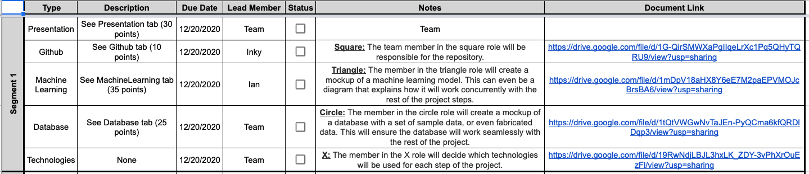

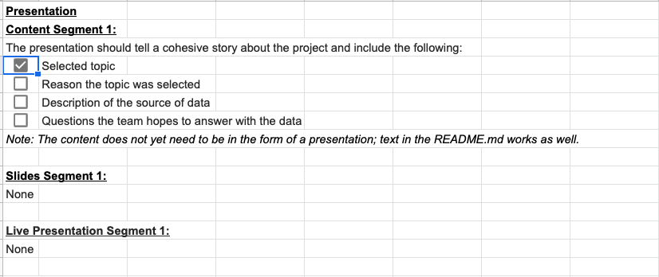

## **Machine Learning Process**

**1) Preliminary data preprocessing**

- Create an output column *MPPG_Status*. *Successful* players are those who play 24 minutes or more per game according to the *MPPG* column.  *Not Successful* players are those who play less than 24 minutes per game.

    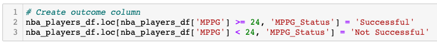

- Drop irrelevant columns based on *Linear Regression* model (See Section 2 below).

    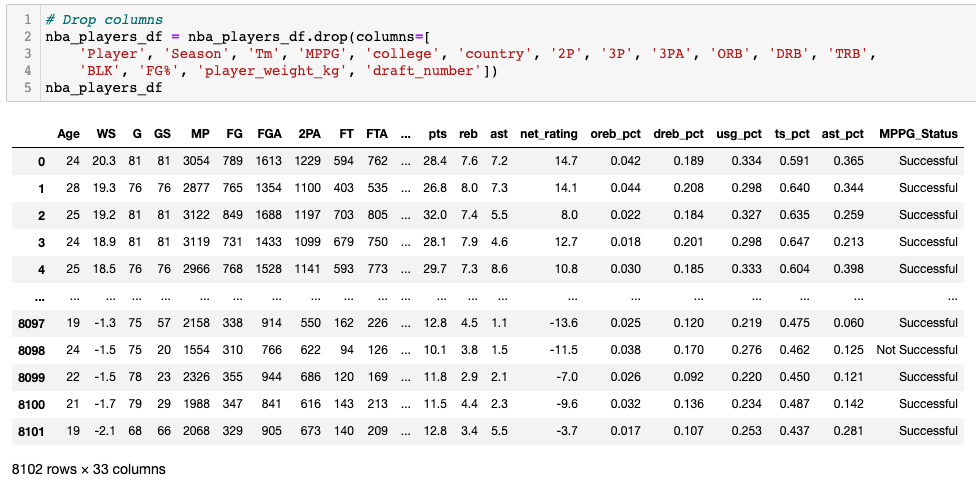

- Replace *dtypes* from strings to integers and replace *NaN* to *0*.
    - **Note:** We did not drop the *NaN* rows as dropping these rows would eliminate players that are significant to this model.  For example, players with 3P% with *NaN* are mostly all big men who typically would not take 3-pointers.  Instead of eliminating these players, we felt the more logical thing to do was to replace these with a *0*. 

    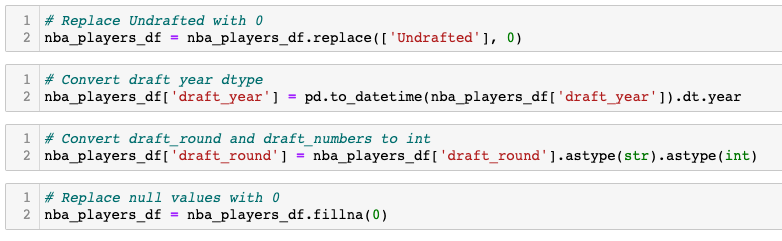

**2)  Preliminary feature engineering and preliminary feature selection**

- We ran a *linear regression* model in order to determine what features are relevant to include in our final machine learning model.

    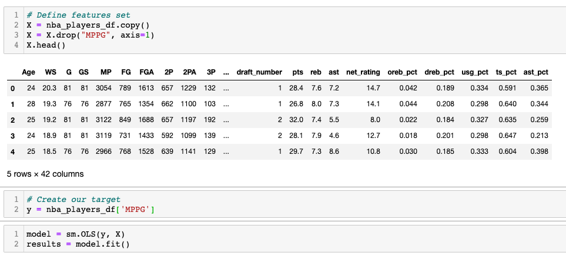

- Results showed that the following columns are below the 0.05 P-value significance level hence we should remove these columns from our feature selection: 2P, 3P, 3PA, ORB, DRB, TRB, BLK, FG%, player_weight_kg, draft_number

**3) Data split into training and testing sets**

- Create our features and our target.

    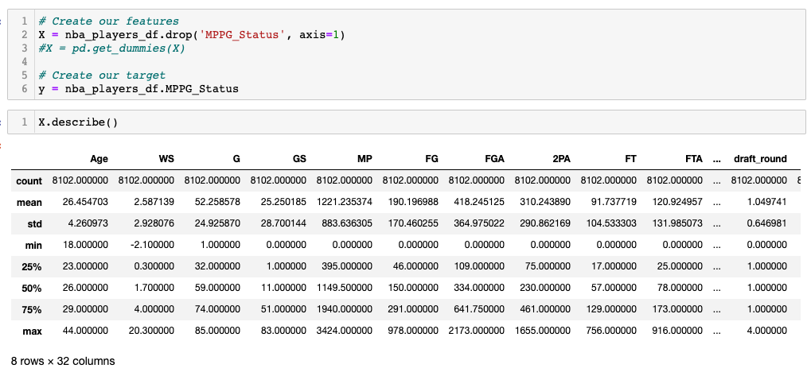

- Split data into training and testing sets.

    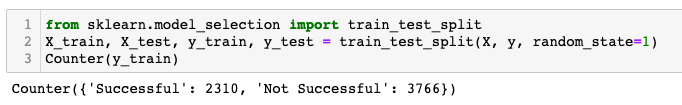

**4) Explanation of model choice, including limitations and benefits**

- We chose the *Random Forest Model* as we wanted reduce overfitting and variance problems, hence improving accuracy.  Also, this model helps rank importance of the features as below.

    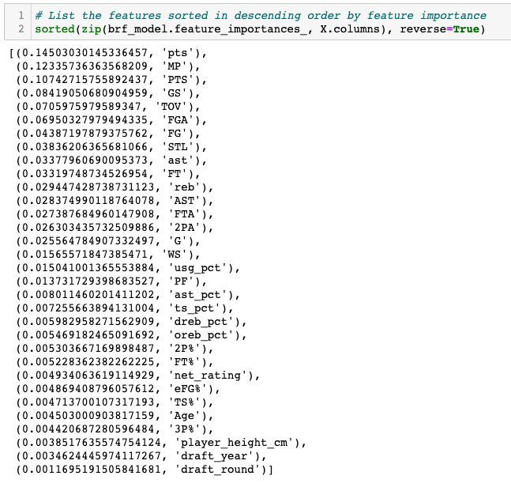

- A limitation with the *Random Forest Model* is that it complex and creates lot of trees requiring more computational power and resources. 

**5) Training our model**

- We used a couple methods to train our model. In addition to using the StandardScaler to train and test our data, one of the key ways we increased the accuracy of our model and trained it was using linear regression models on our features to determine which are the most related to our output, minutes played per game.

**6) Accuracy score**

- From our feature selection and training our model, we were able to achieve an accuracy score of 96.1% for our Random Forest Model shown below.

   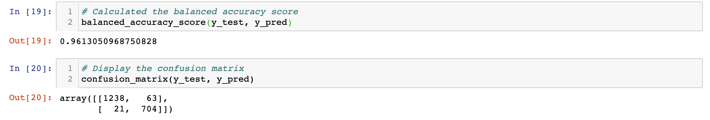

Additionally, our model is well balanced between predicting both the unsuccessful and successful players, which is the core question of our project.

   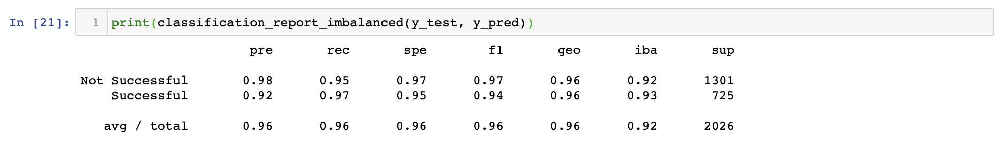

## **Project Outline**

We have outlined the project in the Google Slides presentation: [NBA Success Predictor Presentation](https://docs.google.com/presentation/d/1W8KnGoBi8lcXjScGKJa9Jot-fBMlreqc4T3a1233-38/edit?usp=sharing).

