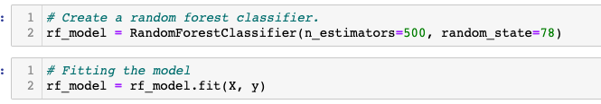

# **NBA Success Predictor**: Database Segment 1

## **Random Forest Model**

For this first segment, we decided that *Random Forest Model* will be a good place to start.  We chose this Ensemble Learning model as we have a lot of input variables or features that will go into determining our output.  

Some of the reasons that *Random Forest Model* can be beneficial is due to:
- It helps against overfitting as this model samples data and creates various decision trees for only that portion and trains these separately. 
- When you have many features, this model can help rank the importance of these features.

